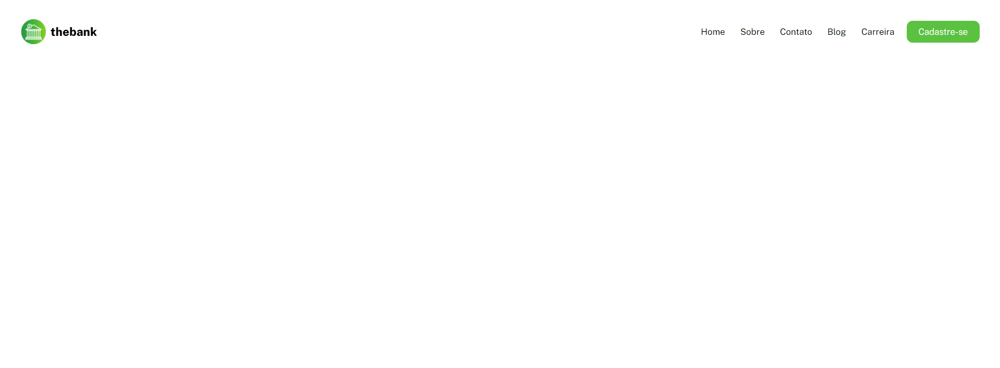
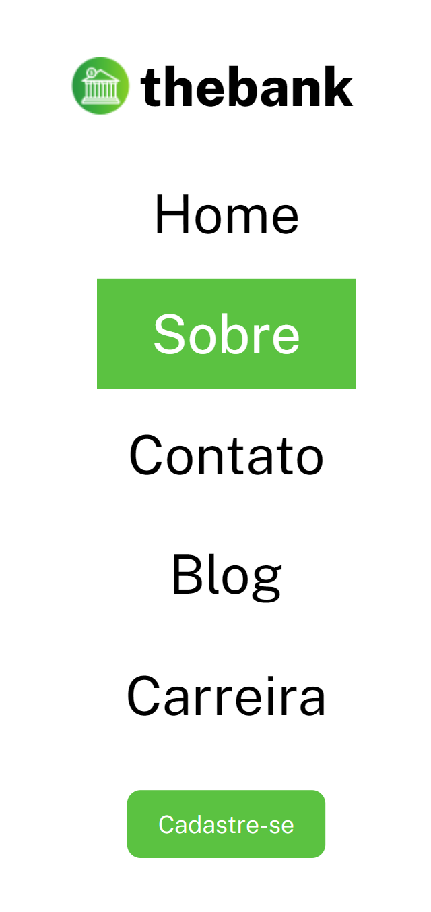

# Menu com Flexbox
Este é mais um desafio de HTML e CSS, utilizando o Flexbox para resolvê-lo da melhor forma.

## Índice

- Design
- Tecnologias utilizadas

## Visão geral

### Design desktop 🖥️

### Design mobile 📱

## Tecnologias utilizadas

- HTML
- CSS
